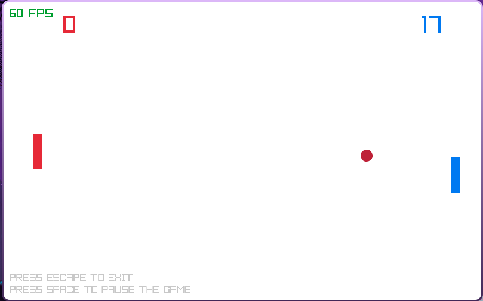

# Pong Game

Este projeto consiste em um minijogo desenvolvido usando a biblioteca RayLib da linguagem C. É uma réplica simples do clássico jogo
arcade Pong lançado em 1972

## Como rodar o jogo

Primeiro, certifique-se de ter instalado o RayLib em seu sistema operacional. Guia de instalação: **<https://github.com/raylib-extras/raylib-quickstart>**

Depois de instalar o RayLib, clone e rode **make** no terminal dentro do diretório do projeto

## Screenshot

